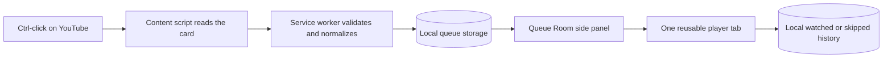
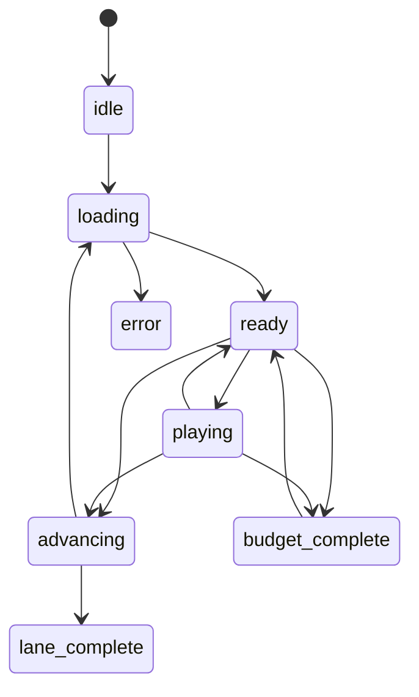

<!-- meta.contentType: Reference -->
<!-- content plan: docs/plans/documentation-plan.md -->

# Understand QueueTube's architecture

QueueTube uses Manifest V3 extension pages, one content script, and local browser storage. This reference explains the data flow, state boundaries, permissions, and failure behavior.

## Follow a pick from click to playback

The content script extracts the selected video's public card metadata. The service worker stores one normalized queue record. No YouTube tab opens in Queue Room mode.

## Separate persistent and session state

QueueTube persists data according to its lifetime:

| Storage area | Data | Lifetime |
| --- | --- | --- |
| `chrome.storage.local` | Schema version, queue items, history, and settings | Until the extension or data is removed |
| `chrome.storage.session` | Playback state, player tab, current item, transition token, and time budget | Until Chrome closes |

The service worker stores no mutable queue state in global variables. Each event reads the current value before it writes an update.

## Keep queue records small

Each queue item stores the normalized video identity and enough metadata to render the Queue Room:

| Field | Purpose |
| --- | --- |
| `id` and `key` | Deduplicate one item within its Short or video lane |
| `kind` | Select the Short or video lane |
| `videoId` | Build a stable thumbnail and playback URL |
| `sourceUrl` | Preserve the selected YouTube link |
| `playbackUrl` | Remove playlists, disable autoplay, and identify QueueTube playback |
| `title`, `channel`, `thumbnailUrl` | Render the queue without opening the video page |
| `durationText`, `durationSeconds` | Display duration and calculate known queue time |
| `addedAt` | Preserve collection order |

Metadata text is trimmed and capped before storage. Thumbnail URLs accept YouTube image hosts only.

## Reuse one player tab

When you play an item, the service worker checks the session's player tab. It updates the existing YouTube tab when possible and creates one when needed.

The playback URL carries three QueueTube parameters:

- `qt_queue=1`: identifies controlled playback
- `qt_kind`: preserves the item's lane after a Short becomes a regular watch URL
- `qt_item`: maps playback back to the stored queue record
- `qt_transition`: identifies one exact player navigation and rejects late events from the previous page

The `manualPlay` preference blocks a controlled page until a pointer or keyboard action targets the player. The independent `pauseBackground` preference pauses YouTube media when its tab is hidden. Both default to on. Each lane has an auto-advance preference; completion records history only when `recordHistory` is enabled. New navigations rebuild the playback URL using current settings, including previously saved picks.

## Expose preferences consistently

`src/settings-ui.js` contains the complete feature catalog and shared controls used by both extension views. Every `DEFAULT_SETTINGS` key must appear exactly once; a regression test checks this. Both views send validated patches to the worker and listen for storage changes. A settings-specific Web Lock serializes read/merge/write operations so simultaneous patches do not overwrite each other.

When migrating pre-v0.3.2 settings, a missing `manualPlay` value inherits the old `pauseBackground` value. Once stored separately, the two switches are independent. New preferences have backward-compatible defaults and keep storage/backup schema 3.

## Guard playback transitions

The Queue Room session uses these explicit states:

Player writes run under a dedicated `navigator.locks` lock. Queue writes use a separate lock. Done, Skip, Later, Previous, and natural completion therefore serialize without blocking ordinary reads. A page event must match the stored player tab, item ID, and transition token before it can change state or history.

`N` is a queue operation rather than an outcome: it moves the current item to the end of its lane, does not write history, and loads the following item using the playback preferences. When history recording is enabled, Done and natural completion record `watched`, and Skip records `skipped`. Previous removes the newest history entry and restores it to its lane.

## Migrate and restore local data

`qtSchemaVersion` is `3`. Installation and version updates rebuild supported stored records through the same sanitizers used for new captures. Migration is idempotent and keeps valid v0.2 queue items, settings, and history while discarding malformed records individually.

Backup restore accepts schema 2 or 3 JSON only. Merge preserves current settings and adds validated, non-duplicate records. Replace applies validated backup settings and resets the active queue session. Backup text is parsed as data and never inserted as HTML.

## Limit YouTube access

QueueTube runs only on YouTube host patterns declared in `manifest.json`. It does not request access to every website.

| Permission | Feature |
| --- | --- |
| `storage` | Saves queues, settings, session state, and local history |
| `tabs` | Reuses a player tab and imports eligible YouTube tabs |
| `tabGroups` | Supports optional Classic tabs mode |
| `sidePanel` | Displays the persistent Queue Room |

The extension validates message senders before processing content-script requests. Extension pages can message the service worker directly. Tab messages must come from YouTube.

## Handle YouTube's dynamic interface

YouTube updates pages without full reloads. The content script listens for YouTube navigation events and observes new cards. It batches queue badge changes across animation frames to avoid long main-thread work.

The metadata extractor accepts several current YouTube card shapes. Missing metadata degrades to a generated YouTube thumbnail and neutral title or channel text.

## Preserve Classic tabs mode

Classic Mode keeps v0.1 behavior. QueueTube creates separate tab groups, converts Shorts to regular watch pages, and marks long-video tabs as discardable.

Classic tab state belongs to Chrome, not QueueTube's local Queue Room. Switching modes does not delete either set of picks.

## Recover from failures

QueueTube treats missing tabs, page navigation races, stale player events, invalid backups, and stale group identifiers as recoverable states. The next action reads current storage and tab state again.

If Chrome removes the player tab, QueueTube clears its session reference. The next playback request creates a replacement tab.
