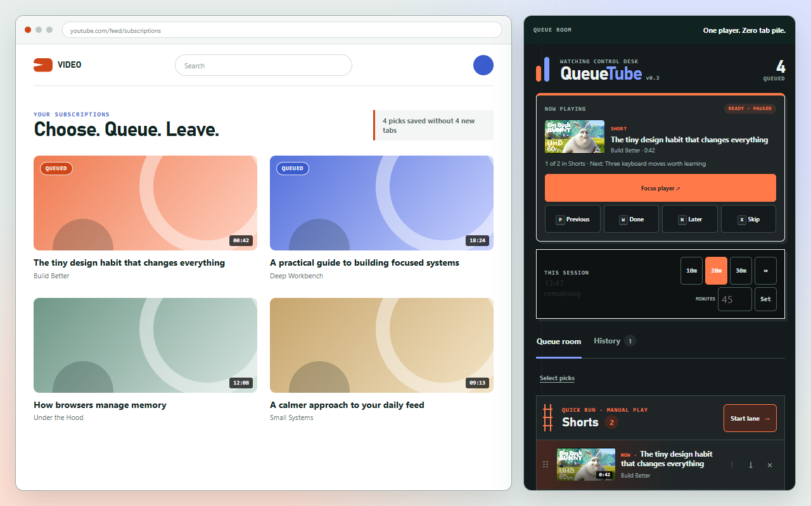

<!-- meta.contentType: Landing -->
<!-- content plan: docs/plans/documentation-plan.md -->

# Queue YouTube picks without opening more tabs

QueueTube turns Ctrl-click into a deliberate YouTube queue. Shorts and long videos stay organized as lightweight local records, then move through one reusable player tab. Picks start paused by default; every playback preference is explained in the popup.



## What QueueTube changes

- **Separate lanes:** keeps Shorts and long videos ordered independently
- **One-tab player:** reuses one YouTube page across the whole queue
- **Reliable sequence:** Done, Skip, and natural completion load the next pick, paused by default
- **Later, not next:** `N` rotates the current pick to the end of its lane
- **Zero-memory waiting:** stores long videos as links until selected
- **Independent playback controls:** choose whether picks start paused and whether switching tabs pauses playback
- **Feature controls:** search and change all 24 preferences in the popup or Queue Room
- **Now Playing:** shows state, lane position, next context, and recovery controls
- **Focus Shield:** hides related videos, comments, merchandise, and end cards
- **Time budgets:** supports 10, 20, 30, or any whole number up to 180 minutes
- **Local tools:** bulk reorder/removal, filtered history, backup copy, and safe restore
- **Themes:** follows the system by default, with fixed Light and Dark choices
- **Classic tabs:** keeps the original grouped-tab workflow as an optional mode

QueueTube has no server, account, analytics, ads, or external JavaScript.

## Customize v0.3.2

Open the popup and select **Features & controls** for the complete preference list. To listen while using another tab, turn off **Pause when leaving a tab** on the popup's main view. Keep **Start each pick paused** on if you still want to start each video yourself. Returning to a paused tab does not automatically resume playback.

Changes save locally and update open YouTube pages. After reloading the extension for an update, refresh previously open YouTube tabs once to load the new content script. Classic tab sleeping and other extensions can also stop or hide playback.

See [all features and controls](docs/FEATURES.md) for defaults, scope, and on-demand queue tools.

## Install or update the local build

For a first install:

1. Download or clone this repository.
2. Open `chrome://extensions` in Chrome.
3. Turn on **Developer mode**.
4. Click **Load unpacked** and select the repository folder.
5. Refresh YouTube tabs that were already open.

After pulling a newer version, keep the same folder and click **Reload** on the QueueTube card. You do not need to load it again. Existing v0.2 queues, settings, history, and supported backups migrate automatically to schema 3.

Chrome 116 or newer is required.

## Collect and watch picks

1. Browse YouTube Home or Subscriptions.
2. Ctrl-click, Command-click, or middle-click a video or Short.
3. Open QueueTube and choose **Queue Room**.
4. Start Shorts or Videos; QueueTube loads the first pick paused by default.
5. Press play in YouTube, then move through the lane with the controls below.

QueueTube marks queued thumbnails and blocks duplicates by default.

### Player keys

| Key | Action |
| --- | --- |
| `W` | Mark Done and load the next pick |
| `N` | Move the current pick to Later, then load the next |
| `P` | Restore and load the previous watched or skipped pick |
| `X` | Mark Skipped and load the next pick |
| `?` | Show or hide the keyboard guide |

Picks follow your **Start each pick paused** preference. Turn **Player keyboard controls** off to disable these keys. They do not run while you are typing in a field. YouTube's Space and `K` play/pause keys still work.

### Chrome-wide shortcuts

Open **Controls & protection → Keyboard setup** to see which shortcuts Chrome actually assigned. QueueTube suggests:

- `Alt+Shift+Q`: open the Queue Room
- `Alt+Shift+S`: start or continue Shorts
- `Alt+Shift+V`: start or continue long videos
- `Alt+Shift+X`: skip the current pick

Chrome may leave suggested shortcuts unassigned. Use QueueTube's **Open Chrome shortcut settings** action or visit `chrome://extensions/shortcuts`.

## Manage a larger queue

- Use **Select picks** for bulk Move top, Move bottom, or Remove.
- Use **Import open tabs** to gather existing YouTube tabs and optionally close only the imported originals.
- Use **Copy backup** for portable v3 JSON.
- Use **Restore backup** to merge into the current queue or deliberately replace it. v2 and v3 backups are validated before storage.
- Filter History by outcome or lane, then restore individual picks.
- Enable **Compact density** to fit more picks in a narrow panel.

## Use Classic tabs

Open **Controls & protection**, then change **Collecting mode** to **Classic tabs**. Shorts open in an orange tab group. Long videos open in a collapsed blue group and become discardable while inactive. v0.3 preserves this compatibility mode; new sequence features belong to Queue Room mode.

## Develop and verify QueueTube

QueueTube uses browser-native JavaScript and has no runtime dependencies. With Node.js 22 or newer:

```powershell
node tools/check-extension.mjs
```

Build the Chrome Web Store ZIP on Windows:

```powershell
powershell -NoProfile -ExecutionPolicy Bypass -File tools/package-extension.ps1
```

Read [the proposed v0.3.3/v0.4.0 roadmap](docs/ROADMAP-NEXT.md), [the completed v0.3 roadmap](docs/ROADMAP-v0.3.md), [the test guide](docs/TESTING.md), [the architecture reference](ARCHITECTURE.md), [accessibility support](docs/ACCESSIBILITY.md), and [the contribution guide](CONTRIBUTING.md).

## Privacy and support

Queue data, settings, budgets, and QueueTube history stay in local Chrome extension storage. Read the [privacy policy](PRIVACY.md) and report defects through [GitHub Issues](https://github.com/RayenBHK/QueueTube/issues).

QueueTube is independent and is not affiliated with or endorsed by YouTube or Google.

## License

QueueTube is available under the [MIT License](LICENSE).
