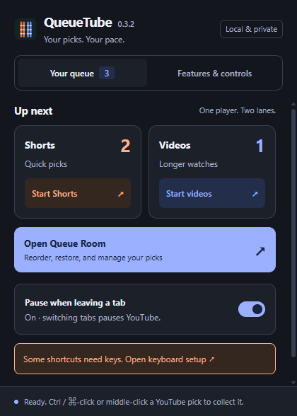
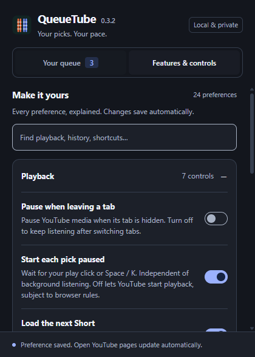

# QueueTube v0.3.2 features and controls

Open the extension popup, then **Features & controls**. Search by feature or description. The same 24 preferences are available under **Controls & protection** in Queue Room. Changes save automatically and update open pages; failed saves show an error. Nothing is sent to a QueueTube server.

## Playback

| Control | Default | What it changes |
| --- | --- | --- |
| Pause when leaving a tab | On | Pauses YouTube video and audio when the tab becomes hidden. Turn off for background listening. Returning never resumes paused media automatically. Also available on the popup's main view. |
| Start each pick paused | On | Requires your play click or Space/K before a queued pick starts. Independent of tab visibility. Off allows YouTube to start playback; browser autoplay restrictions still apply. |
| Load the next Short | On | After a Short ends, loads the next Short in Queue Room, following the start-paused preference. |
| Load the next video | On | Equivalent sequencing for the long-video lane. |
| Shorts in the main player | On | Uses regular watch pages instead of the Shorts interface. Applies when a pick next opens, including picks saved earlier. |
| Player keyboard controls | On | Enables W (Done), N (Later), P (Previous), X (Skip), and ? (help) on queued player pages. Space/K remain YouTube's controls. |
| Session time limit | 0 / off | A whole number from 1 to 180 starts an elapsed-time budget; 0 removes it. Saving restarts the current timer and remembers the default for the next browser session. Pauses count toward the limit. Queue Room budget buttons update the same preference. |

**Background listening recipe:** turn **Pause when leaving a tab** off and leave **Start each pick paused** on. Start the pick yourself, then switch tabs. In Classic mode, also turn off **Sleep inactive video tabs** if you want long-video audio to continue.

## Collecting and memory

| Control | Default | What it changes |
| --- | --- | --- |
| Collecting mode | Queue Room | Queue Room stores lightweight links in separate Shorts/video lanes and reuses one player. Classic creates colored tab groups, with Shorts loaded and long videos eligible for sleeping. Switching modes retains both queues. |
| Capture Ctrl / ⌘-click | On | Captures this collecting gesture on YouTube. Off restores the browser's normal behavior. |
| Capture middle-click | On | Captures wheel-button clicks. Off restores normal middle-click. |
| Prevent duplicate picks | On | Keeps a pick once. Off permits independently controllable repeat entries. |
| Sleep inactive video tabs | On | Classic mode only: requests that Chrome unload inactive long-video tabs. This may stop background audio. Chrome decides whether a tab can be discarded. Turning it off does not reload already sleeping tabs; select one to wake it. |

## Focus Shield

| Control | Default | What it changes |
| --- | --- | --- |
| Enable Focus Shield | On | Applies the four hiding preferences below to YouTube watch/Shorts pages. Turning it off retains their values for later. |
| Hide related videos | On | Hides the recommendation sidebar. |
| Hide comments | On | Hides the comments section. |
| Hide end cards | On | Hides recommendation cards and the end-screen grid. Does not change YouTube's own autoplay switch. |
| Hide merchandise | On | Hides the merchandise shelf. |

Controls that depend on Focus Shield appear inactive when its master switch is off. Other extensions, including Unhook, may independently hide the same content.

## Queue, history, and appearance

| Control | Default | What it changes |
| --- | --- | --- |
| Remove finished picks | On | Removes watched/skipped entries. Off retains them for repeat viewing. |
| Save watch history | On | Stores up to 200 local completion records for filtering, restore, and Previous. Off prevents new history; it neither erases existing records nor disables queue removal. |
| Color theme | System | Choose System, Light, or Dark for both extension views. |
| Compact layout | Off | Reduces spacing while preserving controls and descriptions. |
| Queued labels on YouTube | On | Marks thumbnails saved in Queue Room. |
| Count on the extension icon | On | Shows the current queue count in the toolbar badge. |
| On-page notifications | On | Shows collection/completion confirmations. Errors and time-limit alerts remain visible when off. |

## Tools you run on demand

These do not run automatically and therefore use buttons rather than switches:

- **Queue Room / Start Shorts / Start videos / Return to player:** choose a lane or focus the existing player.
- **Done / Skip / Later / Previous:** record an outcome, rotate a pick, or restore the most recent history entry.
- **Reorder:** drag a pick or use its arrow buttons. Select multiple picks to move them to the top/bottom or remove them.
- **Import tabs:** gather eligible open YouTube tabs; optionally close only newly imported originals.
- **Copy / restore backup:** copy schema 3 JSON or restore schema 2/3 using merge or replace. No upload occurs.
- **History:** filter watched/skipped entries or Shorts/videos, restore a pick, or clear history.
- **Clear queue:** explicitly remove waiting picks after confirmation.
- **Keyboard setup:** open Chrome's shortcut settings to assign, change, or clear extension commands. Chrome manages those key assignments; the player-key switch controls only W/N/P/X/?.

## Updating and compatibility

Reload QueueTube in `chrome://extensions`, then refresh existing YouTube tabs once. Existing queues and history remain. Old versions tied manual start to background pause: v0.3.2 initially copies that old value into both switches, then lets you change them independently. New preferences keep existing behavior by default. Backup schema remains 3.

## UI design notes

The popup uses UI UX Pro Max's minimal, functional design guidance: a focused queue view, readable descriptions, native switches/selects, visible keyboard focus, reduced-motion support, and matching light/dark tokens. The existing orange/blue lane identity and local system fonts are retained. The settings-specific search did not yield a verified pattern; grouped disclosure follows the skill's general form guidance.
